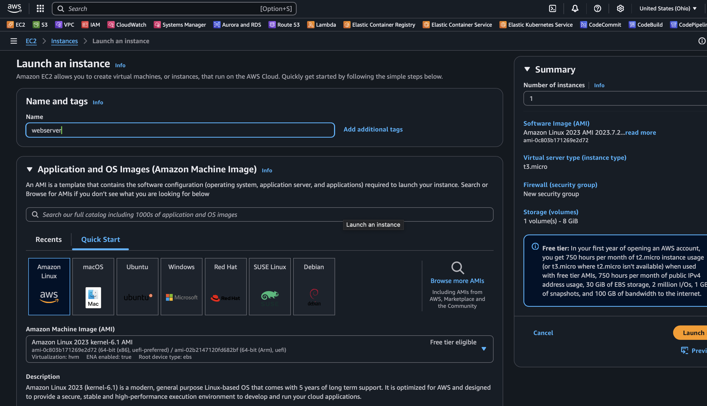
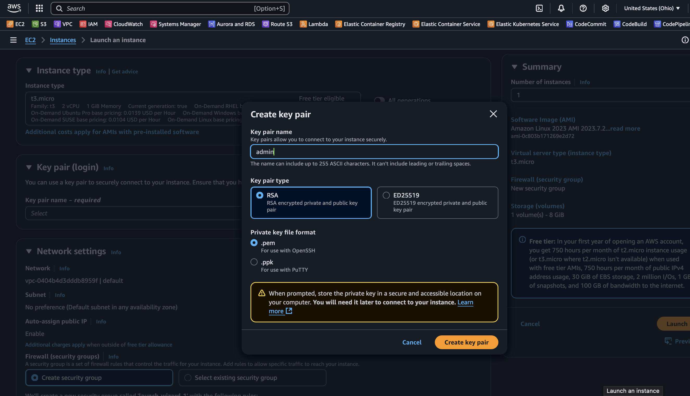
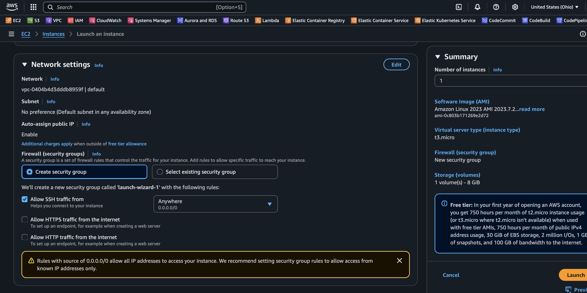
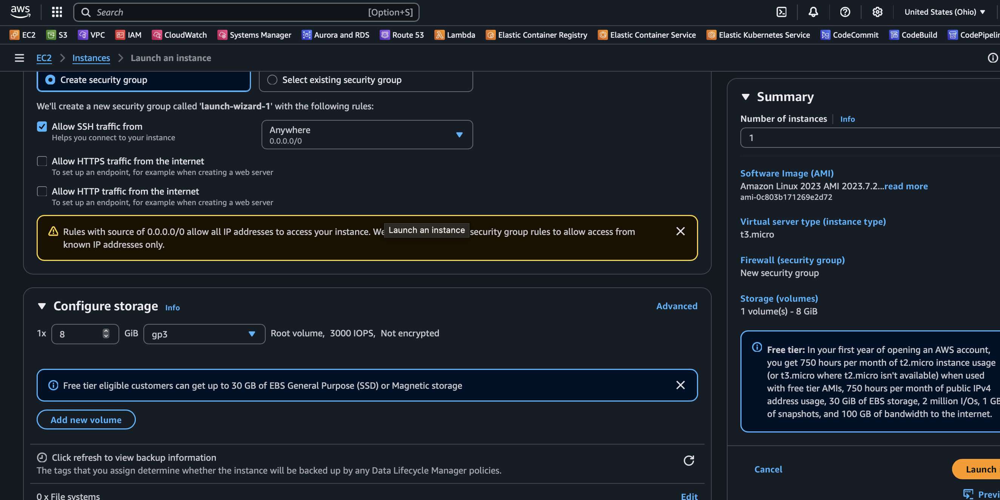
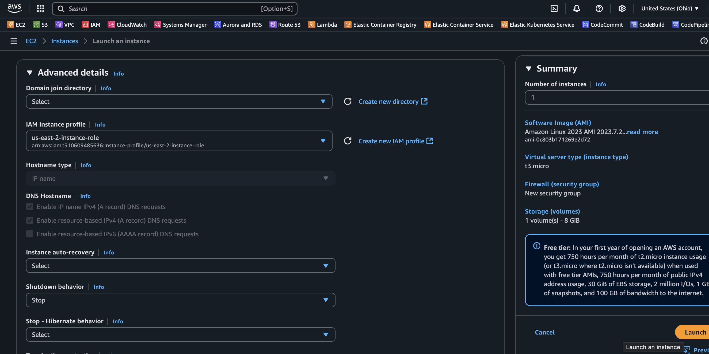

# Amazon EC2 Workshop 💻


## Overview

Amazon Elastic Compute Cloud (EC2) provides scalable virtual servers in the cloud. In this workshop, you'll learn to launch an EC2 instance with encrypted storage, configure security settings, and connect via SSH.

**What you'll build:** A web server instance with encrypted EBS storage and custom user data script.

## Learning Objectives

- Launch and configure EC2 instances
- Set up security groups and key pairs
- Enable EBS encryption
- Connect to instances via SSH
- Use user data scripts for automation

## Prerequisites

- AWS Account with EC2 access
- Basic terminal/SSH knowledge
- Key pair management understanding

---

## Step-by-Step Process in AWS Management Console

### 1. Navigate to EC2 Dashboard

• Sign in to AWS Management Console
• Search for "EC2" in the services search bar
• Click on "EC2" to open the EC2 Dashboard

### 2. Launch Instance

• Click the "Launch Instance" button
• Give your instance a name (e.g., "MyEncryptedInstance")

### 3. Choose AMI

• In the "Application and OS Images" section
• Select "Browse more AMIs"
• Choose "AWS Marketplace AMIs" or "Community AMIs"
• Search for AMI ID: ami-0c803b171269e2d72
• Select the AMI

### 4. Choose Instance Type

• Select your preferred instance type (e.g., t2.micro for free tier)
• Click "Next"

### 5. Configure Key Pair
• In the "Key pair" section:
  • If you have an existing key pair: Select it from dropdown
  • If you need a new one: Click "Create new key pair"
    • Enter key pair name (e.g., "my-ec2-key")
    • Choose key pair type (RSA recommended)
    • Choose private key file format (.pem for Linux/Mac, .ppk for Windows)
    • Click "Create key pair" and download the file
    • **Important**: Save the .pem file securely - you'll need it for SSH

### 6. Configure Network Settings
• Leave "Network" as default (uses default VPC)
• Leave "Subnet" as default (uses default subnet)
• **Security Group Settings**:
  • Create new security group or use existing
  • **Important**: Ensure SSH rule is configured:
    • Type: SSH
    • Protocol: TCP
    • Port: 22
    • Source: Your IP (recommended) or 0.0.0.0/0 (less secure)

### 7. Configure Storage

• In the "Configure storage" section:
  • **Size**: Change to 8 GiB
  • **Volume type**: Select gp3 (recommended) or gp2
  • **Encryption**: Check the box "Encrypted"
  • **KMS key**: Leave as default or select a specific KMS key
  • **Delete on termination**: Check this box (recommended)

### 8. Review and Launch
• Review all settings and click "Launch instance"
• Wait for instance state to change to "Running"

## SSH Connection Steps

### 9. Prepare SSH Key (Linux/Mac)
bash
# Set proper permissions for your key file
chmod 400 /path/to/your-key.pem


### 10. Get Instance Connection Details
• In EC2 Console, select your instance
• Note the Public IPv4 address or Public IPv4 DNS
• Click "Connect" button for connection instructions

### 11. Connect via SSH

For Linux/Mac:
bash
ssh -i /path/to/your-key.pem ec2-user@your-instance-public-ip


Example:
bash
ssh -i ~/Downloads/my-ec2-key.pem ec2-user@54.123.45.67


For Windows (using PuTTY):
1. Convert .pem to .ppk using PuTTYgen
2. Use PuTTY with:
   • Host: your-instance-public-ip
   • Port: 22
   • Auth: Browse and select your .ppk file
   • Username: ec2-user

### 12. Common SSH Connection Commands

Direct connection:
bash
ssh -i your-key.pem ec2-user@instance-public-ip


Connection with verbose output (for troubleshooting):
bash
ssh -v -i your-key.pem ec2-user@instance-public-ip


Using DNS name instead of IP:
bash
ssh -i your-key.pem ec2-user@ec2-xx-xx-xx-xx.compute-1.amazonaws.com


## Important Notes:
• Default username varies by AMI (common ones: ec2-user, ubuntu, admin)
• Ensure your security group allows SSH (port 22) from your IP
• Keep your private key file secure and never share it
• The public IP may change if you stop/start the instance
• Consider using Elastic IP for a static public IP address

## Troubleshooting SSH Connection:
• Verify security group allows SSH on port 22
• Check that your key file has correct permissions (400)
• Ensure you're using the correct username for your AMI
• Verify the instance is in "Running" state
• Check if you're using the correct public IP/DNS

Your instance will be ready for SSH connection once it's in the "Running" state!

## User Data Script

The included [userdata.sh](userdata.sh) script automatically installs and configures Apache web server:

```bash
#!/bin/bash

#Installing and Configuring httpd 
yum install httpd.x86_64 -y # Install your httpd package
systemctl start httpd.service #start httpd
systemctl enable httpd.service # enable httpd
echo "<h1>Hello World from $(hostname)</h1>" > /var/www/html/index.html  #add the content to web page
```

To use this script:
1. In the "Advanced details" section during instance launch
2. Paste the script content in the "User data" field
3. The script will run automatically on first boot

## Next Steps

- Explore EC2 instance types and pricing
- Learn about Auto Scaling Groups
- Set up Application Load Balancers
- Implement monitoring with CloudWatch

## Additional Resources

- [EC2 User Guide](https://docs.aws.amazon.com/ec2/)
- [EC2 Instance Types](https://aws.amazon.com/ec2/instance-types/)
- [EBS Encryption](https://docs.aws.amazon.com/AWSEC2/latest/UserGuide/EBSEncryption.html)
- [Security Groups](https://docs.aws.amazon.com/vpc/latest/userguide/VPC_SecurityGroups.html)

---

**[← Back to Main Workshop](../README.md)**