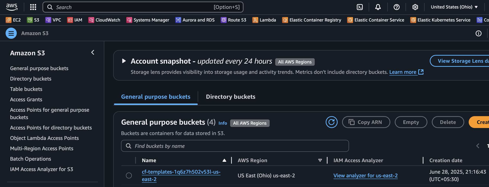

# Amazon S3 Workshop 🗄️

## Overview

Amazon Simple Storage Service (S3) provides secure, durable, and scalable object storage. In this workshop, you'll create an S3 bucket and configure it to host a static website.

**What you'll build:** A static website hosted entirely on S3 with public access configuration.

## Learning Objectives

- Create and configure S3 buckets
- Upload and manage objects
- Configure static website hosting
- Set up bucket policies for public access
- Understand S3 security and permissions

## Prerequisites

- AWS Account with S3 access
- Basic HTML knowledge
- Understanding of web hosting concepts

---

## AWS Management Console Steps

### 1. Create S3 Bucket
• Sign in to AWS Management Console
• Search for "S3" and click on the S3 service
• Click "Create bucket"
• **Bucket name**: Enter a unique name (e.g., "my-static-website-bucket")
• **Region**: Select your preferred region
• **Object Ownership**: Select "ACLs enabled" and "Bucket owner preferred"
• **Block Public Access**: Uncheck all boxes (required for website hosting)
• **Bucket Versioning**: Enable if desired
• **Default encryption**: Configure as needed
• Click "Create bucket"

### 2. Upload Website Files
• Click on your newly created bucket
• Click "Upload"
• Add your HTML, CSS, JS files (ensure you have an index.html file)
• Click "Upload"

### 3. Enable Static Website Hosting
• In your bucket, go to the "Properties" tab
• Scroll down to "Static website hosting"
• Click "Edit"
• Select "Enable"
• **Hosting type**: Choose "Host a static website"
• **Index document**: Enter index.html
• **Error document**: Enter error.html (optional)
• Click "Save changes"

### 4. Configure Bucket Policy for Public Access
• Go to the "Permissions" tab
• Click "Bucket policy" and "Edit"
• Add this policy (replace YOUR-BUCKET-NAME):

json
{
    "Version": "2012-10-17",
    "Statement": [
        {
            "Sid": "PublicReadGetObject",
            "Effect": "Allow",
            "Principal": "*",
            "Action": "s3:GetObject",
            "Resource": "arn:aws:s3:::YOUR-BUCKET-NAME/*"
        }
    ]
}

### 5. Access Your Website
• Go back to "Properties" tab
• Scroll to "Static website hosting"
• Copy the "Bucket website endpoint" URL
• Open the URL in your browser